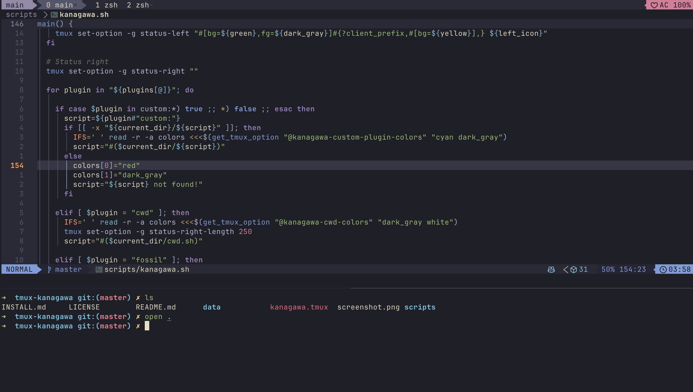

# Thorne for [tmux](https://github.com/tmux/tmux/wiki)

[Thorne](https://github.com/rebelot/thorne.nvim/tree/master) theme for TMUX with
silent colors.

Forked from [Nybkox/tmux-kanagawa](https://github.com/dracula/tmux).

## Install

To activate the theme add the following line to your `.tmux.conf`.

    set -g @plugin 'Elias-Ainsworth/tmux-thorne'

For advanced instructions look at
[INSTALL.md](https://github.com/Nybkox/tmux-thorne/blob/master/INSTALL.md) or
check official instructions of [dracula/tmux](https://draculatheme.com/tmux).
Just replace all `dracula` occurrences with `thorne`.

TODO...
